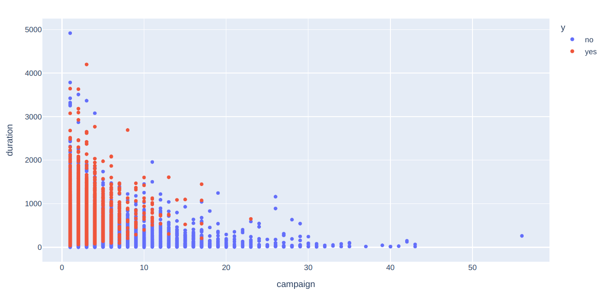
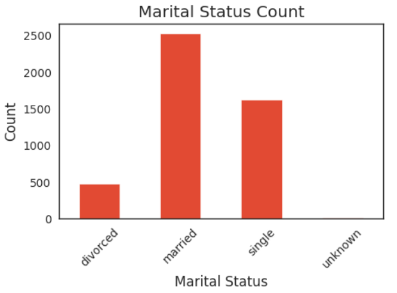

# Bank Marketing Campaign Analysis 📈📊

This project focuses on analyzing the marketing campaign data of a Portuguese bank to improve the efficiency of future campaigns and maximize term deposit subscriptions.

---

## Project Background

The Portuguese bank observed a revenue decline due to reduced client deposits. Term deposits are crucial for banks as they secure funds for investment in higher-gain financial products and enable cross-selling opportunities like insurance and mutual funds. This project aims to identify client profiles with a higher likelihood of subscribing to term deposits and direct marketing efforts toward such clients, enhancing both efficiency and profitability.

---

## Problem Statement

The bank faces challenges in identifying potential clients for term deposits, leading to wasted marketing resources. By analyzing historical campaign data, this project aims to:

1. Identify key factors influencing client decisions.
2. Build a classification model to predict term deposit subscriptions.
3. Provide actionable insights for targeted marketing strategies.

---

## Dataset

The dataset is sourced from the UCI Machine Learning Repository: [Bank Marketing Dataset](https://archive.ics.uci.edu/ml/datasets/bank+marketing).

### Data Overview:
- **Rows**: 41,188
- **Columns**: 21

### Key Features:
- **Age**: Client's age (numeric).
- **Job**: Type of job (categorical).
- **Marital**: Marital status (categorical).
- **Education**: Education level (categorical).
- **Default**: Whether the client has credit in default (categorical).
- **Housing**: Whether the client has a housing loan (categorical).
- **Loan**: Whether the client has a personal loan (categorical).
- **Contact**: Contact communication type (categorical).
- **Duration**: Last contact duration, in seconds (numeric).
- **Campaign**: Number of contacts performed during this campaign (numeric).
- **Poutcome**: Outcome of the previous campaign (categorical).
- **y**: Target variable indicating if the client subscribed to a term deposit (binary: 'yes', 'no').

---

## Data Preprocessing

1. **Data Cleaning**:
   - No missing values found in the dataset.
   - Encoded categorical variables (e.g., `yes`/`no` to 1/0).
   - Handled outliers in numerical features like `age`, `campaign`, and `duration` using the IQR method.

2. **Feature Engineering**:
   - Combined `basic.9y`, `basic.6y`, and `basic.4y` into a single category `middle school` in `education`.
   - Created frequency-encoded features for `job` and `education`.
   - Target-guided ordinal encoding for `marital` based on the likelihood of subscription.

3. **Standardization**:
   - Scaled numerical features using StandardScaler.

---

## Exploratory Data Analysis (EDA)

### Key Insights:
- **Call Duration**:
    
  - Longer calls correlate with a higher likelihood of term deposit subscription.
- **Marital Status**:
    
  - Married clients showed higher deposits, followed by singles.
- **Job Roles**:
  - Administrative staff, technicians, and blue-collar workers were the top contributors to deposits.
- **Seasonality**:
  - Most deposits occurred during May, aligning with the start of the bank's fiscal period.
- **Economic Indicators**:
  - High consumer price index and employee variation rate positively influenced deposits.

---

## Model Development

### Train-Test Split:
- **Training Data**: 80%
- **Testing Data**: 20%

### Model Comparison:

| Model               | Accuracy |
|---------------------|----------|
| Logistic Regression | 87.82%   |
| Decision Tree       | 63.60%   |
| K-Nearest Neighbors | 87.47%   |
| Support Vector Classifier (SVC) | **91.88%** |
| Naive Bayes         | 81.91%   |

### Best Model:
- Logistic Regression (Hyperparameter Tuned): **92.4% Accuracy**.

### Confusion Matrix:
- **True Positives**: 6,399
- **True Negatives**: 178
- **Precision**: 94% (Important for reducing false positives in marketing).

### ROC-AUC:
- The model achieved a high AUC score, demonstrating robust discriminatory power.

---

## Recommendations

1. **Targeted Marketing**:
   - Focus on administrative, technical, and blue-collar workers.
   - Prioritize clients contacted in May or during periods of high economic activity.

2. **Optimize Call Strategies**:
   - Increase call durations with interested leads to improve conversion rates.

3. **Enhance Economic Targeting**:
   - Leverage economic indicators like consumer price index and employment variation rates to identify optimal campaign timings.

---

## Thank You 🙏

